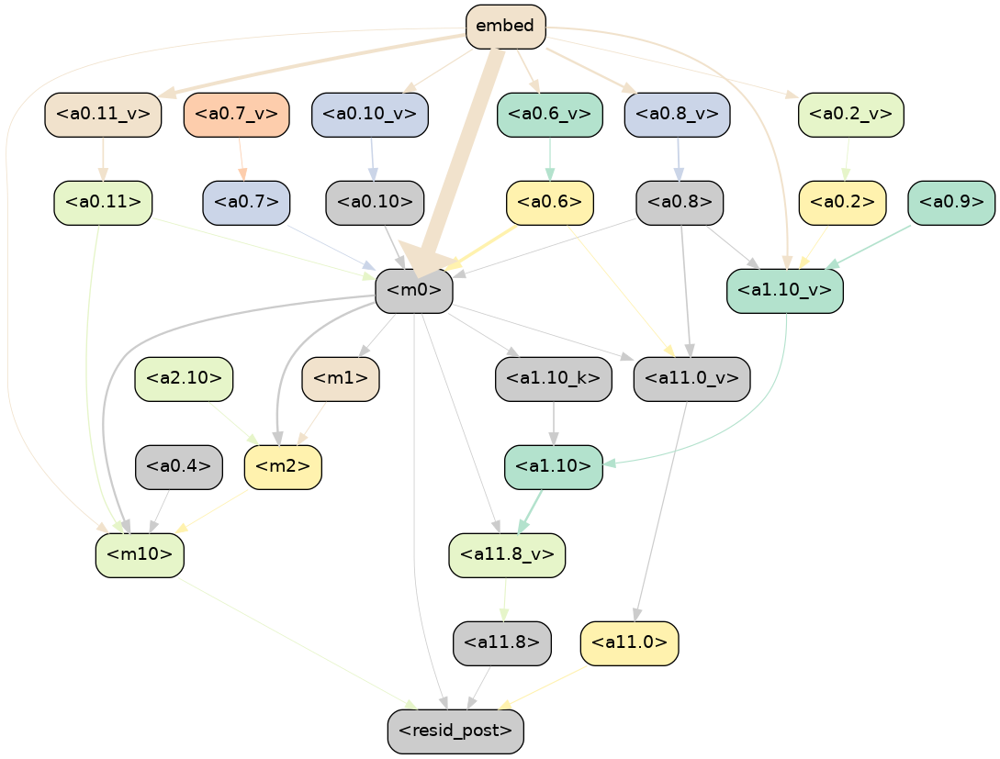
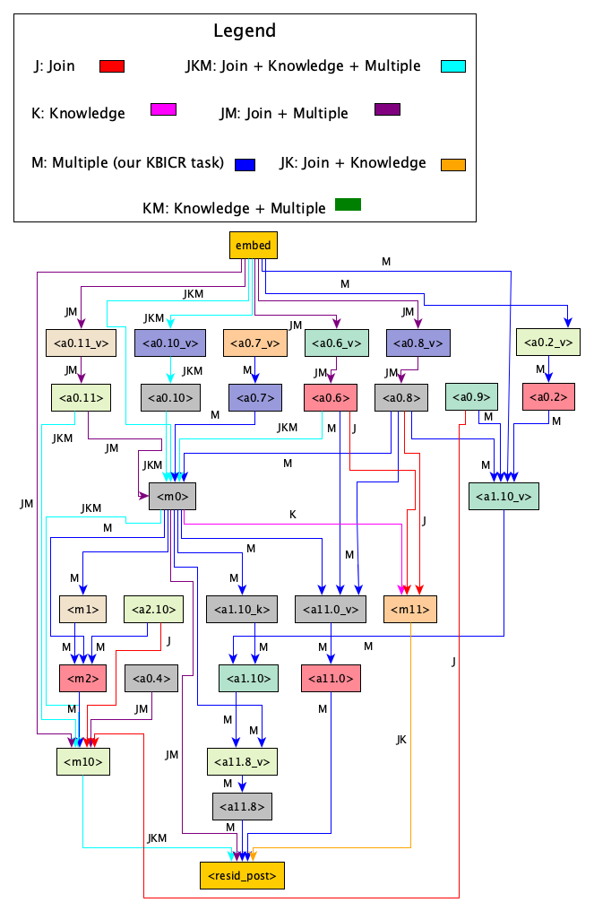

# Knowledge-Based In-Context Retrieval

<!-- 
<figure>
  
  <div style="text-align: center;"><figcaption>GPT-2 small circuit for our indirect Knowledge-Based In-Context Retrieval</figcaption></div>
</figure> -->

<!-- ## Using GPT-2

[HuggingFace docs](https://huggingface.co/docs/transformers/main/en/model_doc/gpt2#openai-gpt2) 

- With `AutoModelForCausalLM` we need to declare `attention_mask` and `input_ids` as: 

```
encoded_input = tokenizer(prompt, return_tensors="pt")
input_ids = encoded_input.input_ids
print(f"Length of tokens: {len(input_ids[0])}")
attention_mask = encoded_input.attention_mask

gen_tokens = model1.generate(
    input_ids,
    attention_mask=attention_mask,
    pad_token_id=tokenizer.eos_token_id,
    do_sample=True,
    temperature=0.1,
    max_length=input_ids.size(1) + 3,
)
```

- With `GPT2Model` and `GPT2LMHeadModel` we can only get the features, it doesn't do generation

- With `pipeline` the generator is not so customizable, but works

Notebooks for inference are inside the `gpt2` subdirectory. -->

Our aim is to find a circuit of components inside the model that points towards a typical behavior that happens when prompted the same type of prompt. A method that automates circuit finding in LLMs is Automatic Circuit Discovery [(ACDC)](https://arxiv.org/pdf/2304.14997). The main author's [blog post](https://arthurconmy.github.io/automatic_circuit_discovery/) is a simpler walkthrough of ACDC.

<!-- Key takeaways:

1. Observe a behavior or task that a neural network displays, create a dataset that reproduces the behavior in question, and choose a metric to measure the extent to which the model performs the task (Logit Difference and KL divergence)

2. Define the scope of the circuit interpretation, i.e. decide to what level of granularity (e.g. attention heads and MLP layers, individual neurons, whether these are split by token position) at which one wants to analyze the network. This results in a computational graph of interconnected model units that perform the given task.

3. Perform an extensive and iterative series of patching experiments, with the goal of removing as many unnecessary edge connections and nodes from the model as possible without hurting performance.  -->

We designed a task that combines Knowledge Retrieval from pretraining memory with In-Context Retrieval in a single prompt setting, which we call Knowledge-Based In-Context Retrieval.   

Knowledge Retrieval: 
```
France - Paris
Russia - Moscow
USA - ...
```

In-Context Retrieval (relationship between person and country/capital):
```
Alice lives in France, Alice - ...
Tom lives in Russia, Tom - ...
John lives in USA, John - ... 
```

The resulting prompt is `Alice lives in France, Paris - Alice, Tom lives in Russia, Moscow - Tom, John lives in USA, Washington -`.

The model should retrieve John which is referred to indirectly by the capital.

We use single token words (notebook for verifying tokenization `gpt2/word_tokenization.ipynb`).

## Prompt Dataset


| **Clean Prompt**                                                                    | **Corruption Schema**                                           | **Corrupted Prompt**                                                                | **Script Path**                          |
|-------------------------------------------------------------------------------------|-----------------------------------------------------------------|-------------------------------------------------------------------------------------|------------------------------------------|
| Alice lives in France, Paris - Alice, Tom lives in Russia, Moscow - Tom, John lives in USA, Washington - John | replace final name with middle name: `{name1} lives in {country1}, {capital1} - {name1}, {name3} lives in {country2}, {capital2} - {name3}, {name2} lives in {country3}, {capital3} - {name2}`  | Alice lives in France, Paris - Alice, John lives in Russia, Moscow - John, Tom lives in USA, Washington - Tom | In ACDC submodule: `acdc/hybridretrieval/datasets/kbicr_template_indirect.py` |

## ACDC

First clone and setup the environment from the [ACDC submodule](https://github.com/Iust1n2/Automatic-Circuit-Discovery/tree/f5fe6c1df4e5179152211023501ae755a5df5759).  

Running ACDC:

Then, in `acdc/main.py` in line 390 use a save path like so:
```
save_path = "acdc/hybridretrieval/acdc_results/kbicr_logit_diff_0.1"
```

And finally run the following command in the terminal for run with zero ablation, alternatively for corruption activation remove `--zero-ablation` flag: 
```
python main.py --task hybrid-retrieval --zero-ablation --metric logit_diff_0.1 --threshold 0.1 --indices-mode reverse --first-cache-cpu False --second-cache-cpu False --max-num-epochs 100000 --local-dir hybridretrieval/acdc_results --dataset kbicr > log.txt 2>&1
```

For running multiple experiments: `./run_kbicr_experiments.sh`

<!-- ! **Note**: We ran ACDC with a KL divergence ranging from 0.001 to 0.5. The former was penalizing the model too much and the latter was not excluding as many edges as we would find it useful for post-hoc interpretation. Also we test zero activation and corruption activation. -->

<!-- ### Circuit recovery

In order to verify the performance of the task circuit, because our task is composed of two subtasks: Knowledge Retrieval and Join, by running ACDC again for the two subtasks we can verify if the two resulting circuits use most of the same components. 

This come as an additional phase in our experiment. We want to see if components for either or from the two smaller circuits are recovered in the bigger circuits. Algorithmically, we created a setting in which nodes fall into 7 categories and for simpliciy we labelled them as J (Join), K (Knowledge) and M (Multiple: Join + Knowledge). So each node can be of the following: 

1. J
2. K
3. M
4. J & K
5. J & M
6. K & M
7. J & K & M

This second phase of our experiment follows this intuition:

First, we convert .gv files for each of the task and subtasks to TGF files (Trivial Graph Forma which can be read by most interactive graph softwares). Script is in `acdc/hybridretrieval/graph_utils/convert_gv_to_tgf.py`.

Second, we need to verify if node components inside of a .tgf is found in another file or in multiple. To do so we need to label them according to the previous notations. Script is in `acdc/hbyridretrieval/graph_utils?graph_overlaps_kj_labels.py`. We generate an equivalent TGF which instead assigns colors as labels for visualization purposes. 

After we generate a `combined_graph.tgf` file we can run it in [yEd](https://www.yworks.com/products/yed) software for interactive and  customizable visualizations, which thankfully supports directed graph layouts. That way we can generate a recovered circuit with color coded nodes that correspond to smaller circuits.    -->
<!-- 
First, run `dot.py` to for conversion to .gv format.

Second run this command in terminal of the saved directory:

```
gv2gml combined_graph_indirect_color_labels.gv > combined_graph_indirect_color_labels.gml 
``` -->

<!-- <figure>
  
  <div style="text-align: center;"><figcaption>GPT2-Small circuit with K, J & M edge labels</figcaption></div>
</figure> -->

## Subnetwork Probing

To run SP `subnetwork_probing/train.py`:

```
python train.py --task hybrid-retrieval --lr 0.001 --lambda_reg 100 --save_dir results > logs/log_kbicr_lr_0.001_lambda_100.txt 2>&1
```

<!-- We run for several learning rate and lambda regularizer values trying to match the ACDC circuit for KBICR. -->

## Investigation Experiments

1. Attention Knockout and Attribute Extraction Rate
    - link to [repo](https://github.com/google-research/google-research/tree/master/dissecting_factual_predictions)
    - `dissecting_factual_predictions/factual_associations_dissection.ipynb`

<!-- 2. In-Context Learning Creates Task Vectors: 
    - link to [repo](https://github.com/roeehendel/icl_task_vectors)
    - `icl_task_vectors/exploration.ipynb` 
    - ! Note: .yaml environment not working properly, tried with a `pip install -r requirements.txt`, modified the code to run GPT2-Small but the code has some further problems. Might look into it just for code intuition and suggestions for working with Hooks in Transformers   -->
<!-- 
2. Language Models Implement Word2Vec Arithmetic: 
    - link to [repo](https://github.com/jmerullo/lm_vector_arithmetic/blob/main/demo.ipynb)
    - `word2vec_llm/word2vec_kbicr.ipynb` -->


2. Circuit Discovery

- `embedding-space/exploration.ipynb` contains analysis of parameter matrices $W_{VO}$ and $W_{QK}$ for individual Attention Heads 
   - link to [repo](https://github.com/guy-dar/embedding-space)

- Direct Logit Attribution, Activation Patching & Path Patching: `notebooks/Circuit_Discovery.ipynb` and `notebooks/Circuit_Discovery2.ipynb`
  -  adaptations of [Main Demo](https://colab.research.google.com/github/neelnanda-io/TransformerLens/blob/main/demos/Main_Demo.ipynb#scrollTo=WTc1ZW-WAwl4) and [Exploratory Analysis Demo](https://colab.research.google.com/github/TransformerLensOrg/TransformerLens/blob/main/demos/Exploratory_Analysis_Demo.ipynb#scrollTo=4-qMuGv91NvJ) from the [TransformerLens library](https://transformerlensorg.github.io/TransformerLens/)

- Attribution Patching: `notebooks/Attribution_Patching.ipynb`
  - adaptation of [Attribution Patching Demo - TLens]((https://colab.research.google.com/github/TransformerLensOrg/TransformerLens/blob/main/demos/Attribution_Patching_Demo.ipynb))

## TODO

<details>
<!-- <summary>Mostly finished TODO list</summary> -->

[ x ] Create template script for prompt dataset 

[ x ] Automate ACDC and SP runs 

[ x ] Run ACDC with new prompt dataset (1 token words) and corruption schema 

[ x ] Run Subnetwork Probing for KBICR

[ x ] Assign function to each Attention Head with Activation Patching and Path Patching

[ x ] Finish off finding the canonical circuit

[ x ] Script for algorithms statistics - node monotonicity and completeness vs the canonical circuit (SP doesn't have support for visualization, so parsing the log files is fine)

[ ... ] Finish the `roc.ipynb` analysis for roc curves for multiple ACDC and SP runs

<!-- [ ? ] Add support for accuracy statistics (ROC) (not working as we do not have a canonical dataset) -->

<!-- [ ] Fix `dissecting_factual_associations/create_json.py` script for subject-attribute dataset  -->

</details>