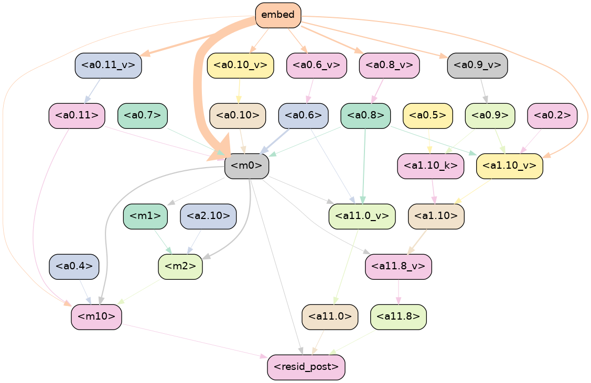
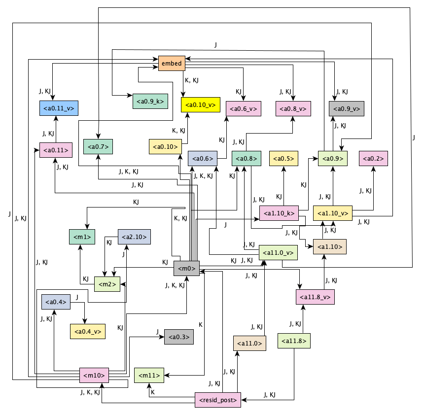

# Automatic Circuit Discovery for Knowledge-Based In-Context Retrieval


<figure>
  
  <div style="text-align: center;"><figcaption>GPT-2 small circuit for our indirect Knowledge-Based In-Context Retrieval</figcaption></div>
</figure>

## Using GPT-2

[HuggingFace docs](https://huggingface.co/docs/transformers/main/en/model_doc/gpt2#openai-gpt2) 

- With `AutoModelForCausalLM` we need to declare `attention_mask` and `input_ids` as: 

```
encoded_input = tokenizer(prompt, return_tensors="pt")
input_ids = encoded_input.input_ids
print(f"Length of tokens: {len(input_ids[0])}")
attention_mask = encoded_input.attention_mask

gen_tokens = model1.generate(
    input_ids,
    attention_mask=attention_mask,
    pad_token_id=tokenizer.eos_token_id,
    do_sample=True,
    temperature=0.1,
    max_length=input_ids.size(1) + 3,
)
```

- With `GPT2Model` and `GPT2LMHeadModel` we can only get the features, it doesn't do generation

- With `pipeline` the generator is not so customizable, but works

Notebooks for inference are inside the `gpt2` subdirectory.

## ACDC 

Our aim is to find a circuit of components inside the model that points towards a typical behavior that happens when prompted the same type of prompt. A method that automates circuit finding in LLMs is Automatic Circuit Discovery [(ACDC)](https://arxiv.org/pdf/2304.14997). The main author's blog [post](https://arthurconmy.github.io/automatic_circuit_discovery/) is a great way of understanding ACDC.
Key takeaways from the paper for ACDC:

1. Observe a behavior or task that a neural network displays, create a dataset that reproduces the behavior in question, and choose a metric to measure the extent to which the model performs the task. We have chosen KL divergence for our metric.

2. Define the scope of the circuit interpretation, i.e. decide to what level of granularity (e.g. attention heads and MLP layers, individual neurons, whether these are split by token position) at which one wants to analyze the network. This results in a computational graph of interconnected model units that perform the given task.

3. Perform an extensive and iterative series of patching experiments, with the goal of removing as many unnecessary edge connections and nodes from the model as possible without hurting performance. 

We designed a task that combines Knowledge Retrieval from memory with In-Context Learning in a single prompt setting, which we call Knowledge-Based In-Context Retrieval.   

Knowledge Retrieval : 
```
France - Paris, Germany - Berlin, USA - ...
```

ICL or informally used in our workflow as Join (relationship between person and country/capital):
```
Alice lives in France, Alice - France.
Bob lives in Germany, Bob - Germany.
John lives in USA, John - ... 
```

The resulting prompt is `Alice lives in France, Paris - Alice, John lives in Germany, Berlin - John, Peter lives in USA, Washington -` and it was also extended for direct and indirect retrieval which changes the dynamic for next-token prediction. 

In order to validate the circuit for our task we designed prompt datasets for KBICR Knolwedge Retrieval only and Join only with the necessary corruptions for running ACDC. The prompt datasets alongside explanations for corruptions are given in the table below and in `acdc/hybridretrieval/datasets/` and our methodology for circuit validation is described in the [Circuit Recovery section](#circuit-recovery).  

## Prompt Dataset


| Task                                          | Correct prompt                                                                                                                                                               | Expected answer | Corruption                                                                                                                                                                                                                     | Corrupted prompt                                                                                                                                                                            | Dataset              |
|-----------------------------------------------|-----------------------------------------------------------------------------------------------------------------------------------------------------------------------------|-----------------|--------------------------------------------------------------------------------------------------------------------------------------------------------------------------------------------------------------------------------|---------------------------------------------------------------------------------------------------------------------------------------------------------------------------------------------|----------------------|
| (Indirect) Knowledge-Based In-Context Retrieval | Prompt 1: Alice lives in France, Paris - Alice, John lives in Germany, Berlin - John, Peter lives in USA, Washington - & Prompt 2: Lucy lives in Turkey, Ankara - Lucy, Sara lives in Italy, Rome - Sara, Bob lives in Spain, Madrid - | Peter, Bob      | First corruption is different country outside the prompt & Second corruption is repeated capital from the prompt                                                                                                                | Alice lives in France, Paris - Alice, John lives in Germany, Berlin - John, Peter lives in Spain, Washington - Peter & Lucy lives in Turkey, Ankara - Lucy, Sara lives in Italy, Rome - Sara, Bob lives in Spain, Ankara - Bob    | Dataset 1  Indirect           |
| (Direct) Knowledge-Based In-Context Retrieval   | Alice lives in France, Alice - Paris, John lives in Germany, John - Berlin, Peter lives in USA, Peter -                                                                 | Washington      | Different name outside the prompt                                                                                                                                                                                                | Alice lives in France, Alice - Paris, John lives in Germany, John - Berlin, Peter lives in USA, Michael - Washington                                                                                                           | Dataset 1 Direct     |
| (Indirect) Knowledge Retrieval                 | Rome - Italy, Madrid - Spain, Ottawa - Canada, Berlin -                                                                                                                                  | Germany         | Corrupt the middle city and repeat the city which has a corruption to see if the model repeats the incorrect country or breaks                                                                                                    | Rome - Italy, Bucharest - Spain, Ottawa - Canada, Bucharest -                                                                                                                                                                   | Dataset 2 Indirect   |
| (Direct) Join                                  | Alice lives in France, Alice - France, Bob lives in Germany, Bob - Germany, John lives in USA, John -                                                                                    | USA             | First corruption is person outside the prompt & Second corruption is person repeated from the prompt                                                                                                                             | Lucy lives in Italy, Lucy - Italy, Tom lives in Spain, Tom - Spain, Sara lives in Canada, Michael -  & Alice lives in France, Alice - France, Bob lives in Germany, Bob - Germany, John lives in USA, Alice -                | Dataset 3 Direct     |
| (Direct) Knowledge Retrieval                   | Italy - Rome, Spain - Madrid, Canada - Ottawa, Germany -                                                                                                                                    | Berlin          | Corruption in the middle country and repeat the country which has a corruption to see if the model repeats the incorrect city or breaks                                                                                          | Italy - Rome, Spain - Bucharest, Canada - Ottawa, Spain -                                                                                                                                                                       | Dataset 2 Direct     |
| (Indirect) Join                                | Prompt 1: Alice lives in France, France - Alice, Bob lives in Germany, Germany - Bob, John lives in USA, USA - & Prompt 2: Lucy lives in Italy, Italy - Lucy, Tom lives in Spain, Spain - Tom, Sara lives in Canada, Canada -        | John, Sara      | First corruption is city outside the prompt & Second corruption is city repeated from the prompt                                                                                                                                | Alice lives in France, France - Alice, Bob lives in Germany, Germany - Bob, John lives in USA, Peru - John & Lucy lives in Italy, Italy - Lucy, Tom lives in Spain, Spain - Tom, Sara lives in Canada, Italy - Sara             | Dataset 3 Indirect   |


## ACDC for Knowledge-Based In-Context Retrieval

Create and compare circuits for the following: 

1. indirect KBICR with indirect K + J 
2. direct KBICR with direct K + J

To run the ACDC algorithm on a task (from Prompting), three steps are required:

First, in `acdc/hybridretrieval/utils.py` in line 20 import the dataset: 
```
from acdc.hybridretrieval.hybrid_retrieval_dataset3direct import HybridRetrievalDataset
```

Then, in `acdc/main.py` in line 390 use a save path like so:
```
save_path = "acdc/hybridretrieval/acdc_results/ims_hybridretrieval_indirect_0.15"
```

And finally run the following command in the terminal: 
```
python main.py --task hybrid-retrieval --zero-ablation --threshold 0.15 --indices-mode reverse --first-cache-cpu False --second-cache-cpu False --max-num-epochs 100000 > log_kbicr_direct_0.15.txt 2>&1
```

! **Note**: Every ACDC run was done with a KL divergence threshold of 0.15. As we experimented with a smaller threshold, as the authors did in the IOI (Indirect Object Identification) task, we found out that the value of the threshold is important in determining the outcome of the circuit. We ran ACDC with a KL divergence ranging from 0.7 to 0.1. The former was penalizing the model too much and the latter was not excluding as many edges as we would find it useful for post-hoc interpretation.

### Circuit recovery

In order to verify the performance of the task circuit, because our task is composed of two subtasks: Knowledge Retrieval and Join, by running ACDC again for the two subtasks we can verify if the two resulting circuits use most of the same components. 

This come as an additional phase in our experiment. We want to see if components for either or from the two smaller circuits are recovered in the bigger circuits. Algorithmically, we created a setting in which nodes fall into 7 categories and for simpliciy we labelled them as J (Join), K (Knowledge) and KJ (Join + Knowledge). So each node can be of the following: 

1. J
2. K
3. KJ
4. J & K
5. J & KJ
6. K & KJ
7. J & K & KJ

This second phase of our experiment follows this intuition:

First, we convert .gv files for each of the task and subtasks to TGF files (Trivial Graph Forma which can be read by most interactive graph softwares). Script is in `acdc/hybridretrieval/convert_gv_to_tgf.py`.

Second, we need to verify if node components inside of a .tgf is found in another file or in multiple. To do so we need to label them according to the previous notations. Script is in `acdc/hbyridretrieval/graph_overlaps_kj_labels.py`. We generate an equivalent TGF which instead assigns colors as labels for visualization purposes. 

After we generate a `combined_graph.tgf` file we use the [yEd](https://www.yworks.com/products/yed) software for interactive and  customizable visualizations, which thankfully supports multiple graph layouts. That way we can generate a recovered circuit with color coded nodes that correspond to smaller circuits.   

<figure>
  
  <div style="text-align: center;"><figcaption>GPT2-Small circuit with K, J & KJ edge labels</figcaption></div>
</figure>

### Explainability

Now we have three resources to check for internal circuits and information flow for our task: 

1. Dissecting Factual Associations:
    - link to [repo](https://github.com/google-research/google-research/tree/master/dissecting_factual_predictions)
    - `dissecting_factual_predictions/factual_associations_dissection.ipynb`
    - ! Note: Works for generating the first graphs for circuit flow with attention knockout to token positions and attribute extraction rates. The vocab projection part errors, probably because it needs adaptation for GPT2-Small, as pointed out in the README

2. In-Context Learning Creates Task Vectors: 
    - link to [repo](https://github.com/roeehendel/icl_task_vectors)
    - `icl_task_vectors/exploration.ipynb` 
    - ! Note: .yaml environment not working properly, tried with a `pip install -r requirements.txt`, modified the code to run GPT2-Small but the code has some further problems. Might look into it just for code intuition and suggestions for working with Hooks in Transformers  

2. Language Models Implement Word2Vec Arithmetic: 
    - link to [repo](https://github.com/jmerullo/lm_vector_arithmetic/blob/main/demo.ipynb)
    - `word2vec_llm/word2vec_llm.ipynb`
    - ! Note: It is probably the easiest out of the 3 to customize for GPT2-Small. Nice and clean code for vocabulary projections for overall use in MLPs and heads.


